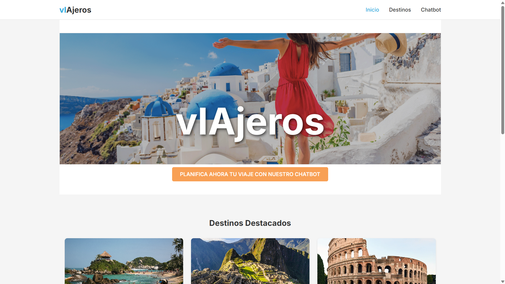
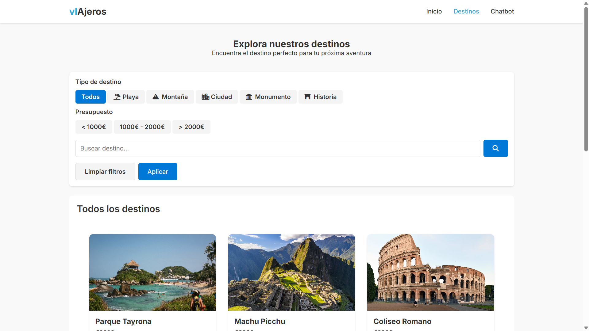
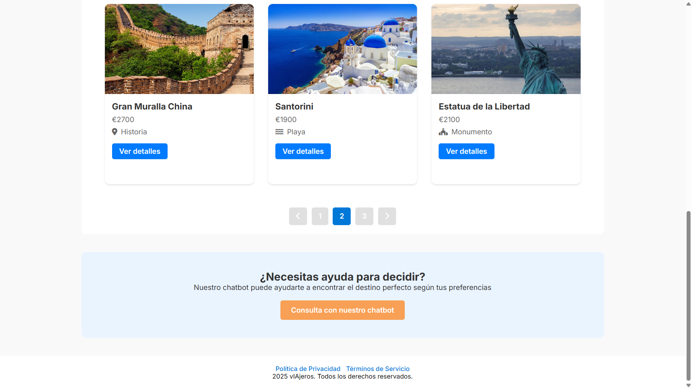
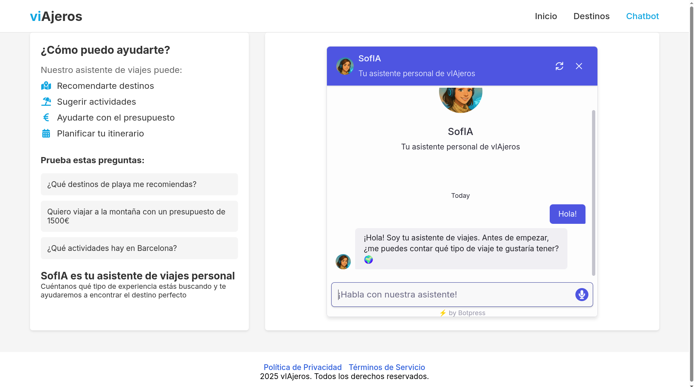

# 📓 **LabBook (contenidos)**

- Título del proyecto: Sistema Recomendador de Viajes y Destinos Turísticos con Chatbot Interactivo
- Grupo de trabajo: Bravo (Juan María Bravo López)
- Fecha de inicio del proyecto: 24/02/2025
- Gestión de Sistemas de Información (GSI) - Escuela Superior de Informática - Universidad de Castilla-La Mancha

---

### 2. **Introducción**

- #### Breve descripción del proyecto y su objetivo.
  El objetivo de este proyecto es desarrollar un sistema de una plataforma web que ayude a los usuarios a elegir destinos turísticos basados en sus preferencias y necesidades. Un chatbot interactivo realizará preguntas al usuario para obtener información relevante sobre sus preferencias de viaje y sus intereses (naturaleza, cultura, gastronomía, aventura, presupuesto, clima preferido, etc.), y en base a sus respuestas, le recomendará y sugerirá destinos turísticos personalizados.
- #### Contexto y motivación del proyecto.
  Este proyecto surge de la necesidad de simplificar y personalizar la búsqueda de destinos turísticos para los usuarios, ofreciendo recomendaciones basadas en sus gustos y preferencias. La interacción con un chatbot facilita la comunicación y la recopilación de información de manera amigable y rápida.
- #### Objetivos y alcance del proyecto.
- Crear un sistema recomendador de viajes y destinos turísticos basado en las preferencias del usuario.
- Desarrollar un chatbot interactivo para realizar preguntas y recoger información del usuario.
- Implementar una interfaz web accesible y atractiva para interactuar con el chatbot.
- Ofrecer recomendaciones personalizadas de destinos turísticos utilizando un motor de recomendación basado en reglas.
- Registrar las interacciones del usuario para futuras mejoras y análisis.
- Almacenar en una base de datos los destinos turísticos y su información relevante.

---

### 3. **Planificación Inicial**

- #### Desglose de fases y cronograma.


- #### Herramientas y tecnologías seleccionadas.
- **Frontend:** HTML, CSS y JavaScript para la interfaz web.
- **Chatbot:** Botpress (intentamos configurarlo antes, pero podemos evaluar otras opciones si hay problemas)
- **Motor de Recomendación:** Basado en reglas simples con JavaScript y uso de datos estructurados en SQLite.
- **Backend:** Aún por definir, pero se considerará si es necesario para la lógica de negocio.
- **Control de Versiones:** Git y GitHub para gestionar el repositorio y colaboraciones.
- #### Requisitos iniciales (funcionales y no funcionales).

##### Requisitos Funcionales:

1. El usuario debe poder interactuar con el chatbot a través de texto.
2. El sistema debe realizar preguntas clave para conocer las preferencias del usuario: intereses, presupuesto, clima preferido, etc.
3. El sistema debe mostrar recomendaciones de destinos basadas en las respuestas del usuario.
4. El usuario debe poder reiniciar el proceso de consulta en cualquier momento.
5. Las recomendaciones deben incluir información básica del destino (descripción, imagen y enlaces relevantes).

##### Requisitos No Funcionales:

1. La interfaz debe ser amigable, intuitiva y receptiva (responsive).
2. El chatbot debe tener tiempos de respuesta rápidos y ser preciso en la interpretación de las respuestas.
3. La plataforma debe ser accesible desde dispositivos móviles y escritorios.
4. No se utilizarán servicios de pago ni APIs con costes asociados.

---

### 4. **Entradas Diarias o Semanales**

```
🗓️ Fecha: 18/03/2025
🔹 Actividades realizadas: Investigación sobre herramientas para chatbots gratuitos. Pruebas iniciales con BotPress y configuración del entorno de desarrollo. Creación de un prototipo rápido de web para comprobar la integración del bot een la misma.
🔹 Dificultades encontradas: Error con la instalación de BotPress usando pnpm.
🔹 Soluciones aplicadas: Se ha trabajado la configuración del bot mediante la web de Botpress (https://app.botpress.cloud/)
🔹 Posibles contratiempos: No podemos asegurar la disponibilidad del chatbot de Botpress a largo plazo, ya que la versión gratuita cuenta con un número limitado de llamadas al bot.
```

```
🗓️ Fecha: 20/03/2025
🔹 Actividades realizadas:
- Creación del repositorio de GitHub y estructuración de directorios.
- Creación del documento de [Definición del Proyecto](docs/definicion_proyecto.md),
- [LabBook](../LabBook.md) y
- [README.md](README.md).
🔹No ha habido dificultades relevantes.
```

```

🗓️ Fecha: 25/03/2025
🔹 Actividades realizadas:
- Creación de prototipos de baja fidelidad para las ventanas principales de la web.
- Revisión y ajustes en la estructura inicial del diseño para garantizar una navegación intuitiva.

🔹 Dificultades encontradas:
- Dudas sobre la disposición óptima de algunos elementos en las ventanas principales.

🔹 Soluciones aplicadas:
- Se realizaron pruebas con diferentes disposiciones y se seleccionó la más clara y funcional.

🔹 Posibles contratiempos:
- Es posible que los prototipos requieran ajustes adicionales posteriormente.
```

```
🗓️ Fecha: 01/04/2025
🔹 Actividades realizadas:
- Añadidas todas las páginas del sistema con un estilo unificado y moderno.
- Incorporados numerosos destinos de ejemplo en la base de datos.
- Implementada la funcionalidad de paginación en la sección de Destinos.
- Desarrolladas las funciones de búsqueda y filtrado de Destinos.
- Añadidas imágenes representativas de todos los destinos mediante URLs.

🔹 Dificultades encontradas:
- Ajustes en el diseño responsivo para garantizar una experiencia óptima en dispositivos móviles.

🔹 Soluciones aplicadas:
- Se realizaron pruebas en diferentes resoluciones y se ajustaron los estilos CSS para mejorar la responsividad.

🔹 Posibles contratiempos:
- Verificar la estabilidad de las URLs de las imágenes a largo plazo, ya que algunas podrían no estar disponibles en el futuro.
```

A continuación, se muestran capturas de pantalla de las páginas principales del sistema, con su nuevo diseño moderno, usable, unificado y atractivo.


<hr>

<hr>

<hr>

```
🗓️ Fecha: 13/04/2025
🔹 Actividades realizadas:
- Finalizado el diseño de la página del chatbot.
- Entrenado el bot para que sea consciente de su rol como asistente de viajes y formule preguntas relacionadas con preferencias de viaje.  Como podemos ver en la siguiente captura de pantalla, el bot ya es capaz de preguntar al usuario por sus preferencias de viaje sin necesidad de que el usuario le indique que lo haga.
```



```
- Integrado el chatbot en la página web con funcionalidad completa y operativa.

🔹 Dificultades encontradas:
- Ajustes en el entrenamiento del bot para mejorar la precisión de las preguntas y respuestas.

🔹 Soluciones aplicadas:
- Se realizaron iteraciones en el entrenamiento del bot y pruebas exhaustivas para garantizar su correcto funcionamiento.

🔹 Posibles contratiempos:
- Monitorear el rendimiento del chatbot en escenarios reales para identificar posibles mejoras.

🔹 Futuras tareas y aproximaciones:
Se debe conseguir que la página de detalles muestre información y detalles sobre cada uno de los destinos. Por el momento, esta página solo actúa como una plantilla modelo con la misma información.
Se ha de mejorar y perfeccionar el uso del chatbot, así como las recomendaciones de mensajes predefinidos.

```

---

### 5. **Referencias**

- Página web de Botpress: https://app.botpress.cloud/
