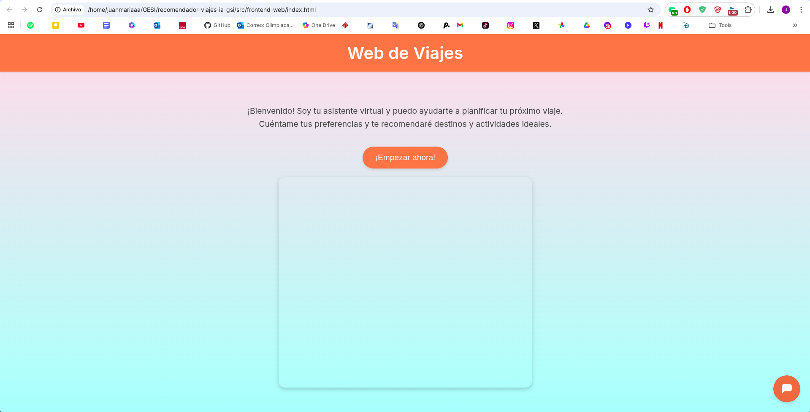
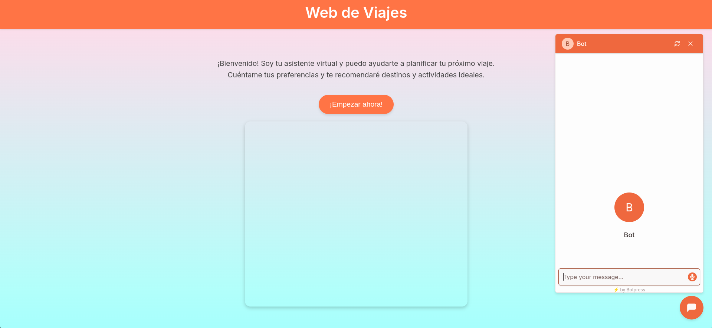

# Sistema Recomendador de Viajes y Destinos Turísticos con Chatbot Interactivo
- Grupo de trabajo: Bravo (Juan María Bravo López)
- Fecha de inicio del proyecto: 24/02/2025
- Gestión de Sistemas de Información (GSI) - Escuela Superior de Informática - Universidad de Castilla-La Mancha

## Índice
### 1. [Manual de Usuario](#manual-de-usuario)
### 2. [Estructura de Directorios del Repositorio GitHub](#estructura-de-directorios-del-repositorio-github)

## Otros Contenidos de Interés
### 1. [Definición del Proyecto](docs/definicion_proyecto.md)
### 2. [LabBook.md](LabBook.md) o en PDF [LabBook.pdf](LabBook_Bravo.pdf)


## 📖 **Manual de Usuario**
Para utilizar el sistema recomendador de viajes y destinos turísticos con chatbot interactivo, sigue estos pasos:

1. Accede a la [página principal](src/frontend/index.html) del sistema.
2. Interactúa con el chatbot respondiendo a sus preguntas.
Actualmente, este proyecto está **en desarrollo**. Puede ver el estado actual del proyecto en el [LabBook](LabBook.md).

Si desea visualizar el aspecto de la web, siga los siguientes pasos:
1. Descargue el repositorio en formato ZIP o clone el repositorio en su máquina local.
2. Abra el archivo `index.html` ubicado en la carpeta `src/frontend/` con su navegador web favorito. Como se muestra a continuación:





## 📁 **Estructura de Directorios del Repositorio GitHub**

```
/recomendador-viajes-ia-gsi/
│
├── 📁 docs/                     # Documentación del proyecto
│   └── definicion_proyecto.md   # Objetivos, requisitos, tecnologías planificadas
│
├── 📁 design/                   # Diseño de la interfaz y wireframes
│   ├── bocetos_ui/              # Bocetos y prototipos de la interfaz
│   └── ui-ideas.md              # Ideas y referencias para el diseño de UI/UX
│
├── 📁 src/                      # Código fuente del proyecto (cuando se inicie el desarrollo)
│   ├── frontend/                # Carpeta para el desarrollo del frontend con HTML, CSS, JS
│   │   ├── index.html           # Página principal de la aplicación
│   │   ├── styles.css           # Estilos CSS para la interfaz
│   │   ├── scripts.js           # Scripts JS para la interactividad de la página
│   │   └── assets/              # Recursos estáticos (imágenes, iconos)
│   ├── backend/                 # Carpeta para el backend si se requiere más adelante
│   └── chatbot/                 # Configuración y scripts del chatbot (Botpress o alternativa)
│
├── 📁 db/                       # Datos y base de datos de destinos turísticos
│
├── 📁 tests/                    # Pruebas y validación del sistema
│
├── 📁 assets/                   # Recursos adicionales (logos, banners)
│
├── README.md                    # Descripción general del proyecto
├── .gitignore                   # Ignorar archivos innecesarios en el repositorio
└── LabBook.md                   # Registro de avances, problemas y soluciones (LabBook)
```

### 📌 **Explicación Breve:**
- **`docs/`**: Documentación inicial para especificar requisitos, definir el alcance y registrar referencias útiles.  
- **`design/`**: Lugar para bocetos y prototipos UI/UX, así como ideas para el diseño de la interfaz.  
- **`src/`**: Será el espacio para el código fuente del frontend y, en caso necesario, del backend.  
- **`db/`**: Contendrá la base de datos para las recomendaciones de destinos turísticos.  
- **`tests/`**: Sección destinada a las pruebas para asegurar calidad del código y experiencia del usuario.  
- **`README.md`**: Documento principal para describir el proyecto, su objetivo y cómo configurarlo.  
- **`LabBook.md`**: Registro del progreso y posibles problemas encontrados durante el desarrollo.  
