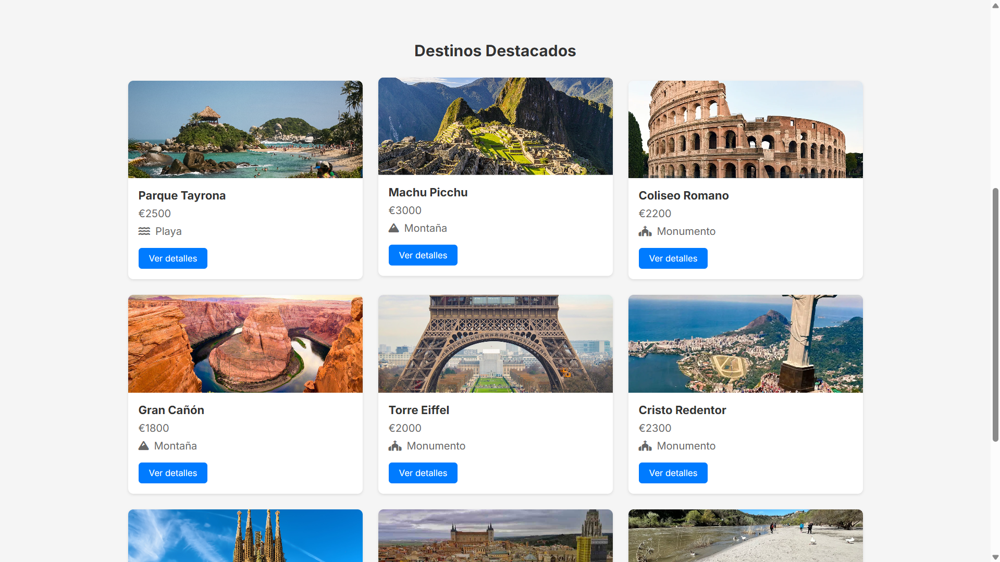
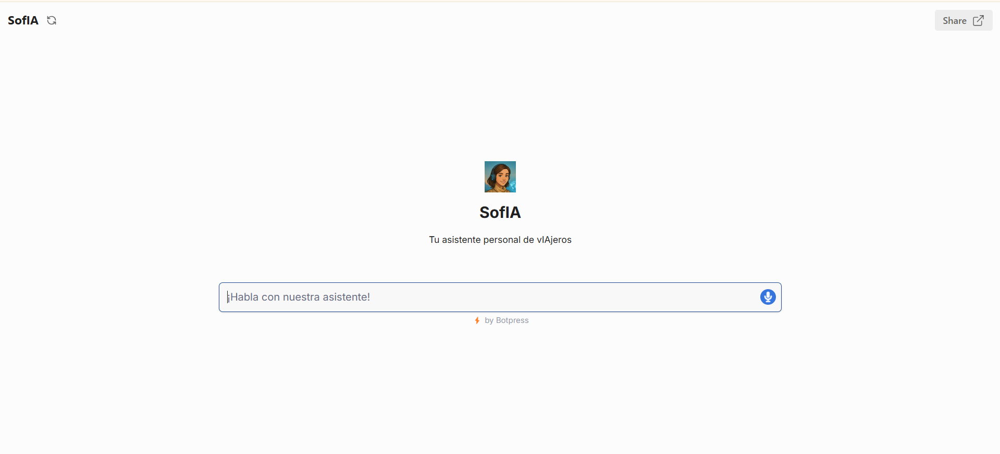

[](https://juanmariabravo.github.io/recomendador-viajes-ia-gsi/)
# Sistema Recomendador de Viajes y Destinos Turísticos con Chatbot Interactivo

- Todo el proyecto ha sido elaborado por [Juan María Bravo López](https://github.com/juanmariabravo)
- Fecha de inicio del proyecto: 24/02/2025
- Fecha de fin del proyecto y presentación: 07/05/2025
- Institución: Escuela Superior de Informática - Universidad de Castilla-La Mancha
- Asignatura: Gestión de Sistemas de Información (GSI)

Este proyecto se ha desarrollado de forma individual para la evaluación práctica de la asignatura de Gestión de Sistemas de Información, cursada en el tercer año de Ingeniería Informática de la Escuela Superior de Informática de Ciudad Real (Universidad de Castilla-La Mancha), durante el curso 2024/2025.

## Índice

#### 1. [Manual de Usuario](#-manual-de-usuario)

#### 2. [Tecnologías Utilizadas](#-tecnologías-empleadas)

#### 3. [Estructura de Directorios del Repositorio GitHub](#-estructura-de-directorios-del-repositorio-github)

#### 4. [Base de Datos](#-base-de-datos)

## Otros Contenidos de Interés

#### 1. [Definición del Proyecto](docs/definicion_proyecto.md)

#### 2. [LabBook.md](LabBook.md) o en PDF [LabBook.pdf](LabBook_Bravo.pdf)

---

## 📖 **Manual de Usuario**

Para utilizar el sistema recomendador de viajes y destinos turísticos con chatbot interactivo, sigue estos pasos:

1. Descargue el repositorio en formato ZIP o clone el repositorio en su máquina local
   ```
   git clone https://github.com/juanmariabravo/recomendador-viajes-ia-gsi.git
   ```
2. Navegue hasta la carpeta `/recomendador-viajes-ia-gsi/src/frontend-web/`. Puede hacerlo desde la terminal o desde el Explorador de Archivos de Windows o de cualquier otro sistema operativo.
   ```
   cd recomendador-viajes-ia-gsi/src/frontend-web/
   ````
4. Abra el archivo `index.html` ubicado en la carpeta `src/frontend-web/` con su navegador web favorito. Como se muestra a continuación:

<p align="center">
  
</p>

---
> También puede desplegarse en local con la extensión de [Live Server en VS Code](https://marketplace.visualstudio.com/items?itemName=ritwickdey.LiveServer)

Desde ahí podrá utilizar con normalidad el chatbot y toda la página web, desplegada de forma local. Las ventanas principales, en escritorio, se verán así:

<table>
  <tr>
    <td></td>
    <td></td>
  </tr>
  <tr>
    <td></td>
    <td></td>
  </tr>
</table>



---
## ⌨️ **Tecnologías Empleadas**
| Componente | Tecnología |
| --- | --- |
| Frontend Web |	HTML5, CSS3, JavaScript (ES6+) |
| Backend Web |  JavaScript (ES6+) |
| Base de Datos | Archivo JSON |
| Chatbot de la web | [Botpress](https://app.botpress.cloud/) |
| Control de Versiones | Git/GitHub |
| Transparencias para la presentación | [Gamma.app](https://gamma.app/) y Power Point |

## 📁 **Estructura de Directorios del Proyecto**

```
/recomendador-viajes-ia-gsi/
│   .gitignore
│   LabBook.md
│   LabBook_Bravo.pdf
│   README.md
│
+---assets
|       *.png // Imágenes Utilizadas en la Web y en la documentación
|
+---db
|       destino-template.json // Plantilla para los destinos
|       destinos.json // Base de datos de los destinos
|
+---design
|   \---wireframes // Wireframes de la web.
|           *.png // Bocetos de baja y media fidelidad
|
+---docs
|       definicion_proyecto.md // Definición del proyecto
|       LabBook_GSI_Proyecto.docx // LabBook del proyecto
|       PromptInicialOculto.txt // Prompt inicial oculto para el bot
|
\---src
    \---frontend-web
        |   chatbot.css // Estilos del chatbot
        |   chatbot.html // Página del chatbot
        |   destinos.css // Estilos de la página de destinos
        |   destinos.html // Página de destinos
        |   detalle-destino.css // Estilos de la página de detalle de un destino
        |   detalle-destino.html // Página de detalle de un destino
        |   index.html // Página principal
        |   privacy-terms.html // Página de privacidad y términos
        |   styles.css // Estilos generales
        |
        \---js
                chatbot.js // Funcionalidad del chatbot
                comentarios-handler.js // Funcionalidad de los comentarios
                destinos.js // Funcionalidad de los destinos
                detalle-destino.js // Funcionalidad de la página de detalle de un destino
                index-destinos.js // Lectura de los destinos populares
                lector-destinos.js // Lectura de todos los destinos
                main.js // Funcionalidad general
                utils.js // Funcionalidades auxiliares
```

### 📌 **Explicación Breve:**

- **`docs/`**: Documentación del proyecto, incluyendo la definición del proyecto, planificación, requisitos, referencias y otros detalles relevantes.
- **`design/`**: Lugar para bocetos y prototipos UI/UX, así como ideas para el diseño de la interfaz.
- **`src/frontend-web`**: Contiene el código fuente del frontend:
  - **HTML**: Archivos principales de las páginas web (`index.html`, `detalle-destino.html`, etc.).
  - **CSS**: Estilos específicos para cada página y estilos generales.
  - **JavaScript**: Funcionalidades específicas para el chatbot, manejo de comentarios, lectura de destinos, y otras utilidades.
- **`db/`**: Contiene la base de datos de los destinos turísticos:
  - `destino-template.json`: Plantilla para añadir nuevos destinos.
  - `destinos.json`: Archivo principal con la información de los destinos turísticos.
- **`assets/`**: Contiene recursos estáticos del proyecto, como imágenes, iconos, etc.
- **`README.md`**: Documento principal que describe el proyecto, su objetivo y cómo configurarlo.
- **`LabBook.md`**: Registro del progreso y posibles problemas encontrados durante el desarrollo.
- **`LabBook_Bravo.pdf`**: Versión PDF del registro del progreso y posibles problemas encontrados durante el desarrollo.
- **`LabBook_GSI_Proyecto.docx`**: Versión Word del registro del progreso y posibles problemas encontrados durante el desarrollo.

## 📚 **Base de Datos:**

La base de datos se encuentra en el archivo `db/destinos.json` y contiene la información de los destinos turísticos. Cada destino tiene las siguientes propiedades:


