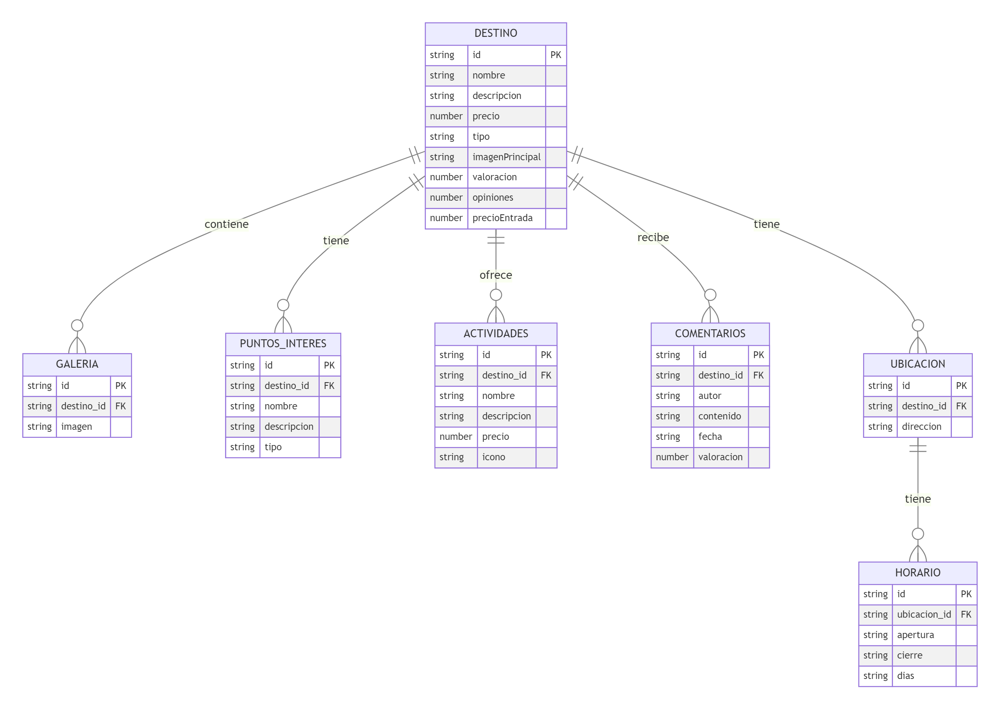

# Sistema Recomendador de Viajes y Destinos Turísticos con Chatbot Interactivo

- Grupo de trabajo: Bravo (Juan María Bravo López)
- Fecha de inicio del proyecto: 24/02/2025
- Gestión de Sistemas de Información (GSI) - Escuela Superior de Informática - Universidad de Castilla-La Mancha

## Índice

### 1. [Manual de Usuario](#-manual-de-usuario)

### 2. [Estructura de Directorios del Repositorio GitHub](#-estructura-de-directorios-del-repositorio-github)

### 3. [Base de Datos](#-base-de-datos)

## Otros Contenidos de Interés

### 1. [Definición del Proyecto](docs/definicion_proyecto.md)

### 2. [LabBook.md](LabBook.md) o en PDF [LabBook.pdf](LabBook_Bravo.pdf)

---

## 📖 **Manual de Usuario**

Para utilizar el sistema recomendador de viajes y destinos turísticos con chatbot interactivo, sigue estos pasos:

1. Descargue el repositorio en formato ZIP o clone el repositorio en su máquina local
   ```
   git clone https://github.com/juanmariabravo/recomendador-viajes-ia-gsi.git
   ```
2. Navegue hasta la carpeta `/recomendador-viajes-ia-gsi/src/frontend-web/`. Puede hacerlo desde el Explorador de Archivos de Windows o de cualquier otro sistema operativo.
3. Abra el archivo `index.html` ubicado en la carpeta `src/frontend-web/` con su navegador web favorito. Como se muestra a continuación:

<p align="center">
  
</p>

---
Desde ahí podrá utilizar con normalidad el chatbot y toda la página web, desplegada de forma local. La página principal se verá así:

<table>
  <tr>
    <td></td>
    <td></td>
  </tr>
  <tr>
    <td></td>
    <td></td>
  </tr>
</table>


---

## 📁 **Estructura de Directorios del Proyecto**

```
/recomendador-viajes-ia-gsi/
    .gitignore
    LabBook.md
    LabBook_Bravo.pdf
    README.md
|
+---assets
|       *.png // Imágenes Utilizadas en la Web y en la documentación
|
+---db
|       destino-template.json // Plantilla para los destinos
|       destinos.json // Base de datos de los destinos
|
+---design
|   \---wireframes // Wireframes de la web.
|           *.png // Bocetos de baja y media fidelidad
|
+---docs
|       definicion_proyecto.md // Definición del proyecto
|       LabBook_GSI_Proyecto.docx // LabBook del proyecto
|       PromptInicialOculto.txt // Prompt inicial oculto para el bot
|
\---src
    \---frontend-web
        |   chatbot.css // Estilos del chatbot
        |   chatbot.html // Página del chatbot
        |   destinos.css // Estilos de la página de destinos
        |   destinos.html // Página de destinos
        |   detalle-destino.css // Estilos de la página de detalle de un destino
        |   detalle-destino.html // Página de detalle de un destino
        |   index.html // Página principal
        |   privacy-terms.html // Página de privacidad y términos
        |   styles.css // Estilos generales
        |
        \---js
                chatbot.js // Funcionalidad del chatbot
                comentarios-handler.js // Funcionalidad de los comentarios
                destinos.js // Funcionalidad de los destinos
                detalle-destino.js // Funcionalidad de la página de detalle de un destino
                index-destinos.js // Lectura de los destinos populares
                lector-destinos.js // Lectura de todos los destinos
                main.js // Funcionalidad general
                utils.js // Funcionalidades auxiliares
```

### 📌 **Explicación Breve:**

- **`docs/`**: Documentación del proyecto, incluyendo la definición del proyecto, planificación, requisitos, referencias y otros detalles relevantes.
- **`design/`**: Lugar para bocetos y prototipos UI/UX, así como ideas para el diseño de la interfaz.
- **`src/`**: Será el espacio para el código fuente del frontend y, en caso necesario, del backend.
- **`db/`**: Contendrá la base de datos para las recomendaciones de destinos turísticos.
- **`assets/`**: Contendrá los recursos estáticos del proyecto, como imágenes, iconos, etc.
- **`README.md`**: Documento principal para describir el proyecto, su objetivo y cómo configurarlo.
- **`LabBook.md`**: Registro del progreso y posibles problemas encontrados durante el desarrollo.
- **`LabBook_Bravo.pdf`**: Versión PDF del registro del progreso y posibles problemas encontrados durante el desarrollo.
- **`LabBook_GSI_Proyecto.docx`**: Versión Word del registro del progreso y posibles problemas encontrados durante el desarrollo.

## 📚 **Base de Datos:**

La base de datos se encuentra en el archivo `db/destinos.json` y contiene la información de los destinos turísticos. Cada destino tiene las siguientes propiedades:

