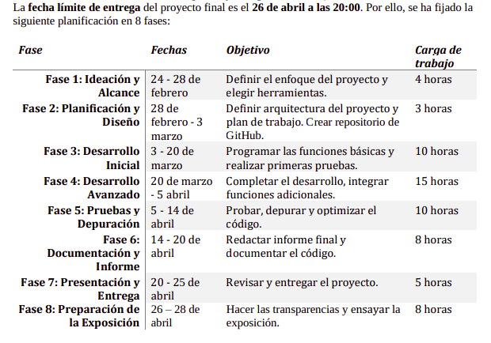

> Grupo de trabajo: **Bravo (Juan María Bravo López)**

> Trabajo de Teoría Asignado: Inteligencia Artificial aplicada al Turismo y la Hostelería

## 📝 **Definición del Proyecto: Sistema Recomendador de Viajes y Destinos Turísticos con Chatbot Interactivo**

### **🎯Breve Descripción y Objetivo del Proyecto:**
El objetivo de este proyecto es desarrollar un sistema de una plataforma web que ayude a los usuarios a elegir destinos turísticos basados en sus preferencias y necesidades. Un chatbot interactivo realizará preguntas al usuario para obtener información relevante sobre sus preferencias de viaje y sus intereses (naturaleza, cultura, gastronomía, aventura, presupuesto, clima preferido, etc.), y en base a sus respuestas, le recomendará y sugerirá destinos turísticos personalizados.

---

## **🗂️ Alcance del Proyecto:**
- Crear un sistema recomendador de viajes y destinos turísticos basado en las preferencias del usuario.
- Desarrollar un chatbot interactivo para realizar preguntas y recoger información del usuario.
- Implementar una interfaz web accesible y atractiva para interactuar con el chatbot.
- Ofrecer recomendaciones personalizadas de destinos turísticos utilizando un motor de recomendación basado en reglas.
- Registrar las interacciones del usuario para futuras mejoras y análisis.
- Almacenar en una base de datos los destinos turísticos y su información relevante.

---

## **👥 Público Objetivo:**
- Personas interesadas en viajar y explorar destinos turísticos.
- Usuarios que buscan recomendaciones personalizadas y rápidas sin necesidad de investigar a fondo.

---

## **🔍 Requisitos Funcionales:**
1. El usuario debe poder interactuar con el chatbot a través de texto.
2. El sistema debe realizar preguntas clave para conocer las preferencias del usuario: intereses, presupuesto, clima preferido, etc.
3. El sistema debe mostrar recomendaciones de destinos basadas en las respuestas del usuario.
4. El usuario debe poder reiniciar el proceso de consulta en cualquier momento.
5. Las recomendaciones deben incluir información básica del destino (descripción, imagen y enlaces relevantes).

---

## **⚙️ Requisitos No Funcionales:**
1. La interfaz debe ser amigable, intuitiva y receptiva (responsive).
2. El chatbot debe tener tiempos de respuesta rápidos y ser preciso en la interpretación de las respuestas.
3. La plataforma debe ser accesible desde dispositivos móviles y escritorios.
4. No se utilizarán servicios de pago ni APIs con costes asociados.

---

## **🛠️ Tecnologías y Herramientas a Utilizar:**
- **Frontend:** HTML, CSS y JavaScript para la interfaz web.
- **Chatbot:** Botpress (intentamos configurarlo antes, pero podemos evaluar otras opciones si hay problemas)
- **Motor de Recomendación:** Basado en reglas simples con JavaScript y uso de datos estructurados en SQLite.
- **Backend:** Aún por definir, pero se considerará si es necesario para la lógica de negocio.
- **Control de Versiones:** Git y GitHub para gestionar el repositorio y colaboraciones.

---

## **📅 Planificación Inicial del Desarrollo:**

---

## **📊 Métricas de Éxito:**
- Precisión de las recomendaciones según las preferencias del usuario.
- Satisfacción del usuario basada en feedback simulado o pruebas de usuario.
- Tiempo de respuesta del chatbot.
- Usabilidad y accesibilidad de la interfaz web.
